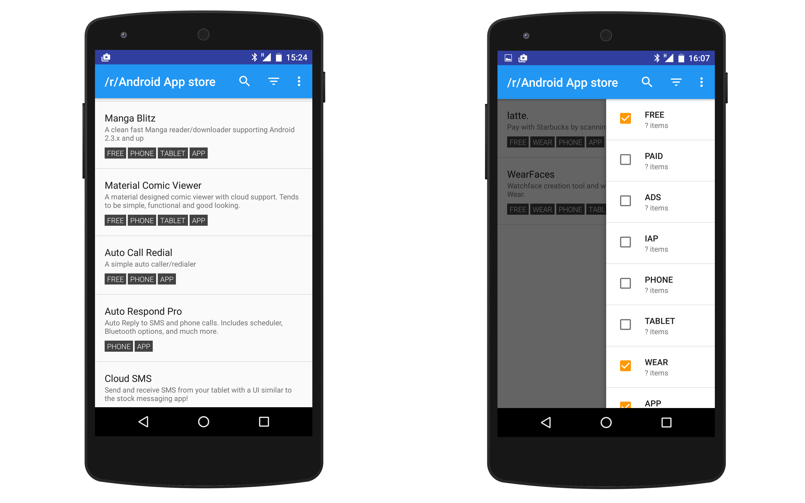

# /r/Android App Store

App inspired by [this reddit post](https://redd.it/50rafp)

Simply pulls the curated app list from the [/r/Android wiki](https://www.reddit.com/r/android/wiki/apps) and displays.

## How to Contribute
* Make sure there is an issue for what you are working on __(create one if necessary)__
* Write into that issue ticket that you are working on it
* Follow current coding style
* If you can, write a unit test for your code change
* Send in a pull request and reference your ticket

## Questions?
[Create an issue](https://github.com/d4rken/reddit-android-appstore/issues/new)

## Screenshots
From commit [36e4daa](https://github.com/d4rken/reddit-android-appstore/commit/36e4daaa4a1f9969917c3fc3833213d68c684bf4)

## License
[Apache 2.0](LICENSE)
