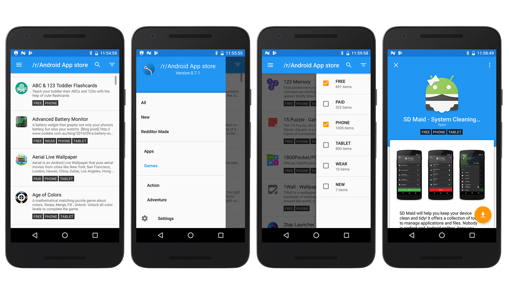

# /r/Android App Store
[](LICENSE)
[](https://travis-ci.org/d4rken/reddit-android-appstore)
[](https://coveralls.io/github/d4rken/reddit-android-appstore)

App inspired by [this reddit post](https://redd.it/50rafp)

Displays the curated app list from the [/r/Android wiki](https://www.reddit.com/r/android/wiki/apps).

## Features
* Filter by category (Apps, Games, etc.) and traits (New, Free, Phone, Wear, etc.)
* Search through the apps list
* View screenshots and read brief summaries of each app
* Go straight to each app's download page
* Night and AMOLED themes
* ...and more!

## Screenshots
From commit [269d4fa](https://github.com/d4rken/reddit-android-appstore/commit/269d4fab0fd2a4553c7d51dcaaf5da82de3883a3)



## How to Contribute
* Make sure there is an issue for what you are working on __(create one if necessary)__
* Write into that issue ticket that you are working on it
* Follow current coding style
* If you can, write a unit test for your code change
* Send in a pull request and reference your ticket

## Questions?
[Create an issue](https://github.com/d4rken/reddit-android-appstore/issues/new)

[Submit your App](https://androidflair.github.io/wikiapps/)

## License
```
Copyright 2016 Matthias Urhahn and Garret Yoder

Licensed under the Apache License, Version 2.0 (the "License");
you may not use this file except in compliance with the License.
You may obtain a copy of the License at

    http://www.apache.org/licenses/LICENSE-2.0

Unless required by applicable law or agreed to in writing, software
distributed under the License is distributed on an "AS IS" BASIS,
WITHOUT WARRANTIES OR CONDITIONS OF ANY KIND, either express or implied.
See the License for the specific language governing permissions and
limitations under the License.
```
